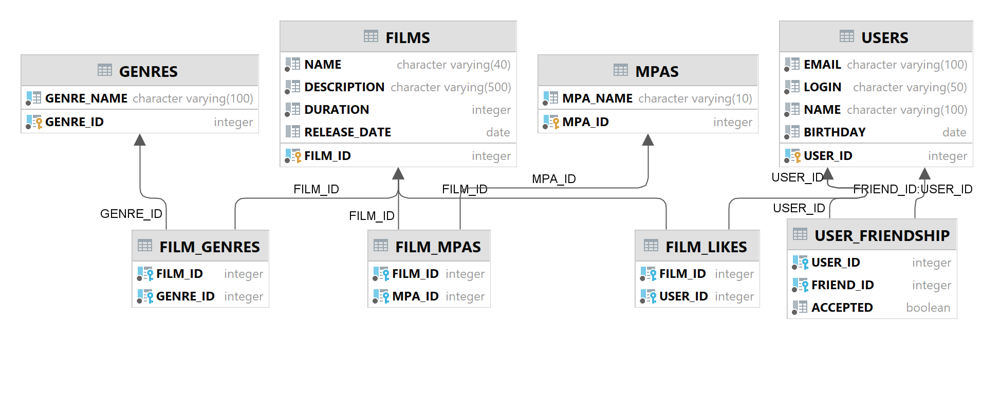

# java-filmorate
Template repository for Filmorate project.


# Scheme of database for filmorate


## Some examples of queries

* Get a data for films
```sql
SELECT *
FROM films
WHERE film_id = ?
```

* Updating data for a film
```sql
UPDATE films
SET name = 'new name',
    description = 'description',
    duration = 120,
    release_date = 2000-05-06
WHERE film_id = 1
```

* Deleting data from film_likes
```sql
DELETE
FROM film_likes
WHERE film_id = 1
  AND user_id = 2
```

* Getting a genre from film_id
```sql
SELECT g.genre_id AS genre_id,
       g.genre_name AS genre_name
FROM film_genres AS fg
LEFT OUTER JOIN genres AS g ON fg.genre_id = g.genre_id
WHERE fg.film_id = ?
```

* Getting a mpa from film_id
```sql
SELECT m.mpa_id AS mpa_id,
       m.mpa_name AS mpa_name
FROM film_mpas AS fm
LEFT OUTER JOIN mpas AS m ON fm.mpa_id = m.mpa_id
WHERE fm.film_id = ?
```
